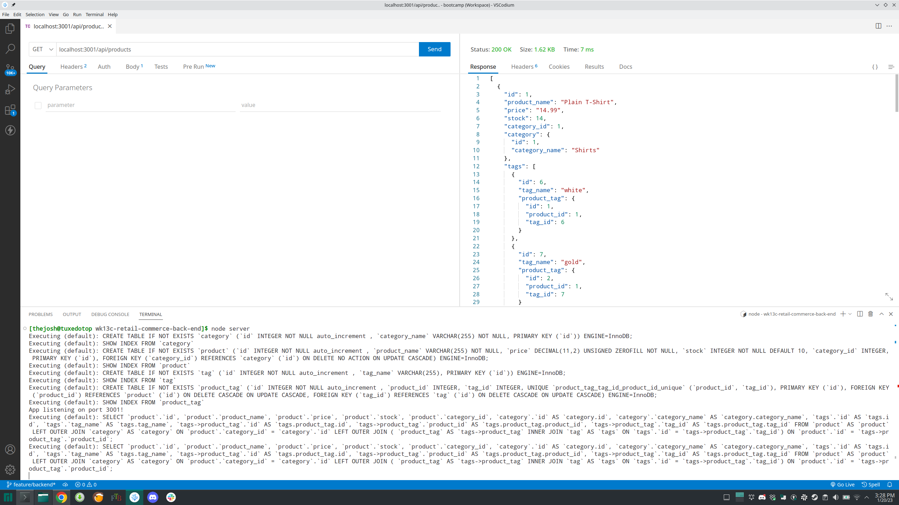

# wk13c-retail-commerce-back-end

## Description

A modern e-commerce backend for various products. It allows users to view all or individual products, categories, and tags. It has the additional functionality to create, update, and remove products, categories, and tags as well. The backend development was developed for an internet retail company for their e-commerce website to compete with other modern companies.

## Installation

The following installation steps below can be used to use the application.

- Install MySQL and NodeJS for your OS version
    - Configure MySQL
- Clone the repository to her local machine
- Create a '.env' file in the root directory
    - Use the database name: 'ecommerce_db'
    - Add your MySQL user name and password
- Open a terminal to the root of the cloned repo
- Run the following command in the terminal: $ npm i
- Log into MySQL in the terminal and run the following command:
    - $ source db/schema.sql;
    - $ exit
- Run the following commands in the terminal:
    - $ npm run seed
    - $ node server.js

## Usage

In order to use the backend to view all items, use the following paths:
- '/api/products'
- '/api/categories'
- '/api/tags'

To view, update, or delete an individual item, add the item ID, '/id', to the path along with any new or updated information.

Here is a video walkthrough: https://drive.google.com/file/d/1FBXdRwGS50gR_3NJSod0DpKlXJyKi0qJ/view

## Credits

Starter files provided here: https://du.bootcampcontent.com/denver-coding-bootcamp/DU-VIRT-FSF-PT-10-2022-U-LOLC/-/tree/main/13-ORM/02-Challenge/Develop

## License

Refer to license in repository.
